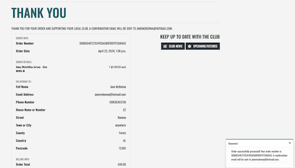

# The Club
[View live project Here](https://the-club-77a7b1e1e156.herokuapp.com/)
***

The Club is the online home of The Seans GAA Club Threemilehouse. The club allows users, players and members of the community to purchase club gear, pay player subs, catch up on club and community news and view upcoming fixtures. The admin views also allow the managers and board of the club to manage and view sub payments, list games, news etc. 

- [Blog Website](#blog-website)
- [User Experience UX](#user-experience-ux)
  - [UX-strategy](#ux-strategy)
  - [UX-scope](#ux-scope)
  - [UX-structure](#ux-structure)
  - [UX-skeleton](#ux-skeleton)
  - [UX-surface](#ux-surface)
- [Technologies-used](#technologies-used)
- [Testing](#testing)
- [Deployment](#deployment)
- [Credits](#credits)

# User Experience UX

## UX-strategy

The goal of the project is to provide a one stop shop for the local community to interact with their club. In an increasingly cashless society paying for club subs and gear has become a chore. The Club allows users to pay subs online and administrators still have the ability to add subs manually. As a not for profit community organisation the additional revenue generated from sales of club merchandise are used to further enhance the club for the community. Social Media has in recent years become the primary platform to communicate club news and fixtures. The Club brings that communication back to a central point which is owned and operated by the club but also provides the opportunity for additional revenue generation. 

**Developer Goals**

- **Build portfolio:** Building my portfolio is crucial for showcasing my skills, projects, and achievements to potential employers or clients. It serves as a demonstration of my expertise and capabilities in web development.
- **Develop my technical skills:** Continuously improving my technical skills is essential for staying competitive in the field of web development and advancing my career. It involves learning new languages, frameworks, tools, and best practices.
- **Deliver a real world project:** Contributing to my community club by delivering a real-world project not only benefits the organisation but also provides me with valuable experience, exposure, and satisfaction. It allows me to make a meaningful impact and give back to my community
- **Build a Functional Website:** Develop a fully functional website that meets the requirements outlined in the project scope, including features like user authentication, product management, news publishing, and event management.
- **Implement Responsive Design:** Ensure that the website is responsive and displays correctly on various devices and screen sizes, including desktops, tablets, and smartphones. Test the website's responsiveness across different browsers to guarantee a consistent user experience.
- **Utilise Django Framework Effectively:** Leverage the Django framework's features and best practices to streamline development, enhance security, and optimise performance. Follow Django conventions for project structure, URL routing, template rendering, and database interactions.
- **Integrate Stripe Payment Gateway:** Successfully integrate the Stripe payment gateway to enable online payments for club membership fees/player subscriptions, and merchandise purchases. Implement secure payment processing and handle transactions seamlessly within the website.
- **Provide User-Friendly Admin Interface:** Develop an intuitive and user-friendly admin interface for managing website content, including club news, events, products, and user accounts. Enable administrators to easily add, edit, or delete content without requiring extensive technical knowledge.
- **Conduct Thorough Testing:** Conduct comprehensive testing of the website to identify and address any bugs, errors, or usability issues. Perform unit testing, integration testing, and user acceptance testing to ensure that all features work as intended and deliver a seamless user experience.

**User Stories**

[Full User Stories](https://docs.google.com/spreadsheets/d/1QvcKgmC9WbiC6ZFg4j-qCKpRea_9rqwP6MOy0nx6mpA/edit?usp=sharing)

_As a FIRST TIME user of the site I want to be able to:_
- Intuitively and easily navigate the site
- Browse club items for sale
- Purchase club gear
- Read news
- Find upcoming fixture
- Register as a user
- Logout of the site

_As a RETURNING user of the site I want to be able to:_
- Log in and out of the site
- Pay subs
- Browse club items for sale
- Purchase club gear
- Review most recent news easily
- See updated fixtures
- Search for specific fixtures

**Admins**

I considered that due to the nature of the Club there may be two types of admin for a site such as this. Community volunteers, coaches etc and then admin of the overall site. I wanted to create an easy UI for more casual administrators making it easy for them to administer everyday tasks on the site without utilising the built in Django admin. 

_As an admin of the site I want to be able to:_
- Manage Product Categories (add, edit, delete)
- Manage Products (add, edit, delete)
- Manage News (add, edit, delete)
- Manage Fixtures (add, edit, delete)
- Manage Players (add, edit, delete)
- Manage Subs (view and add)

Further administrative features are provided by the built in Django Admin Panel. 

## UX-scope

**Existing Features**

**Home Page**

**Nav Bar**

**Logo**

**Shop and Search/Filter Features**

Shop items can be searched from the main nav, browsed in the shop or filtered by category or price etc. Individual product pages then allow the user to add the item to their basket

**Basket**

The basket icon in the Nav keeps a running total of the items the user has added to the basket. 

**Checkout and Stripe Payments**

Having added items to their basket the user can checkout and pay for their items 

**Order Confirmation**

**Club News**

Club News can be accesed from teh home page as well as a prompt from the order confirmation page. Admin users have CRUD functionality for News. 

**Fixtures**

Fixtures can be accessed and searched for the relevant fixture or team the user wants to find

**Footer**

**Register Page**

**Login Page**

**Profile Page**

Profile page includes the ability to update standard delivery information as well as view historical orders. 

**Logout**

**Administrator Features**

- CRUD Functionality for Player, Products, Product Categories, News, and Fixtures. As well ability to view and add subs. I made the choice not to add edit and delete subs into this UI for admin purposely. The functionality still exists within the built in Django admin panel but I wouldn't envisage the community admins of this page to require that access as items may get deleted accidentally. 

_**404/500 Error Pages:**_

- A 404 error page will display if a user tries to navigate to a page that doesn't exist. 
- A 500 error page will display if there is an internal server error.
- Both error pages contain the familiar navigation but will also redirect back to the homepage after 5 seconds. 

**Future Improvements**

- User commenting on News
- Training schedules

## UX-structure

- _Navigation_: Logo, search function, shop, fixtures, account and basket to facilitate browsing the site. On mobile devices the navigation collapses to a familiar hamburger icon which the user will find familiar. 

- _Search Feature_: searches the club kit items for sale with placeholder text of 'shop club kit' for user clarity. 

- _Menu Items_: Navigation menu items allow the user to navigate intuitively through the site. 

- _News Section_: The news section of the home page displays the 10 most recent news articles (with most recent first). The Club News heading is a clickable link with eye catching hover css to ensure clear user understanding. 

- _Club Shop and Shop Items_: Accessed via the Nav or through an initial search I have included buttons to navigate to the individual product pages, add items to the bag and keep shopping button for ease of navigation. When a superuser is logged in there are additionally edit and delete buttons to allow the superuser to manage the products. 

- _Bag Page_: This is broken up to display subs section and products separately. with appropriate details and buttons for both. The products quantity can be updated or deleted while the individual subs lines can be removed from the bag. 

- _Checkout Page_: Here the user either inputs their address and contact details or it is pre-populated if they have an account and details saved. Bag items are displayed and well separated between subscriptions and items for delivery. If the user isn’t logged in there are optional links to login or register otherwise theres a checkbox to save the information provided. To process payment I make use of the stripe widget and functionality. 

- _Fixtures_: Accessed via the navigation I have included search functionality to make finding fixtures easier as well as and all fixtures button to remove search filters and a home button. 

- _Account_: Depending on status appropriate navigation is displayed for club admin, login, logout, register, my profile.

- _Back to top button_: Where I envisaged the length of the page could become long I included a back to top button on those pages. 

**Data Structure**

**Security**

Some of the advantages of using Django are the built in security features. Django built in security documentation can be found [here](https://docs.djangoproject.com/en/5.0/topics/security/) including the use of csrf_token.

Some of the additional defensive choices I made during coding this project were using:
- @login_required decorator
- defensive redirects

## UX-skeleton

**Design Choices**

I choose a modern visually appealing style for the site, using a cohesive color palette and modern font. The colors used on the site were derived from the background image on the home page. 

**Wireframes**

To follow best practice wireframes were developed for Mobile followed by tablet and desktop. I used [Balsamiq](https://balsamiq.com/) to design my wireframes. 

[View Wireframes](wireframes.md)

## UX-surface

**Colour Palette**

The colour palette consists of a harmonious combination of colours derived from the background home image. I took hex values from the image to create a visually appealing and cohesive aesthetic. The colours are used consistently throughout the site, enhancing brand identity and visual coherence.

**Fonts**

I used [Google Fonts](https://fonts.google.com/) to choose Oswald font for my project as it adds modern and stylish touch. I felt that the font is legible and complements the design effectively.

**Images**

I would like to thank my brother in law Ashley Maguire who is treasurer of the club who inspired this project for providing all the images with the exception of the background home image which I [created using AI](https://color.adobe.com/create/image)

**Responsiveness**

I replied heavily on a combination bootstrap and media queries to ensure the site was visually appealing and well laid out on all screens.

# Technologies-used
- **Libraries:** jQuery, Bootstrap 
- **Python Framework:** Django
- **Languages:** HTML, CSS, JavaScript, Python
- **Database Management:** Elephant SQL, AWS
- **Payment Services:** Stripe
- **Version Control:** Git
- **Gitpod:** used as a cloud code editor.
- **GitHub:** used as a cloud based code repository.
- **Heroku:** was used to deploy the app. 

# Testing 
[View Testing Documentation](TESTING.md)

# Deployment
The Website has been deployed using Heroku [Here](https://the-club-77a7b1e1e156.herokuapp.com/) using the method below:

### Heroku Deployment

- I logged into my Heroku Account. 
- I clicked on New and choose 'Create New App'
- I choose a unique name for my app and set the region to Europe. 
- I then chose Github as the deployment method and searched for my repo name. 
- I then clicked on settings and updated the config variables. 
- I navigated back to the deploy and enabled automatic deployment. 

Heroku needs two additional files in order to deploy properly.
- requirements.txt
- Procfile

You can install this project's **requirements** (where applicable) using:
- `pip3 install -r requirements.txt`

You can update your requirements.txt file using:
- `pip3 freeze --local > requirements.txt`

The **Procfile** should be a project level file and can be created using:
- `echo web: gunicorn the_club.wsgi:application --log-file - > Procfile`

This project can be cloned or forked in order to make a local copy on your own system.

For either method, you will need to install any applicable packages found within the *requirements.txt* file.
- `pip3 install -r requirements.txt`.

- You will need to set your own environment variables for:

` DATABASE_URL
  STRIPE_PUBLIC_KEY
  STRIPE_SECRET_KEY
  STRIPE_WH_SECRET`

If you use AWS to host your static/media files you will also need to set

` AWS_ACCESS_KEY_ID
  AWS_SECRET_ACCESS_KEY
  AWS_STORAGE_BUCKET_NAME
  AWS_S3_CUSTOM_DOMAIN = f'{AWS_STORAGE_BUCKET_NAME}.s3.amazonaws.com'`

Otherwise these must be adjusted as appropriate within settings.py

`# Static and Media Files
    STATICFILES_STORAGE = 'custom_storages.StaticStorage'
    STATICFILES_LOCATION = 'static'
    DEFAULT_FILE_STORAGE = 'custom_storages.MediaStorage'
    MEDIAFILES_LOCATION = 'media'
        # Override static and media URLs in production
    STATIC_URL = f'https://{AWS_S3_CUSTOM_DOMAIN}/{STATICFILES_LOCATION}/'
    MEDIA_URL = f'https://{AWS_S3_CUSTOM_DOMAIN}/{MEDIAFILES_LOCATION}/'`

If you use gmail as your service provider for email then you will also need to set environment variables for:

    `EMAIL_HOST_USER 
    EMAIL_HOST_PASSWORD 
    DEFAULT_FROM_EMAIL`

#### Cloning

You can clone the repository by following these steps:

1. Go to the [GitHub repository](https://github.com/janebmckenna/MilestoneProject4) 
2. Locate the Code button above the list of files and click it 
3. Select if you prefer to clone using HTTPS, SSH, or GitHub CLI and click the copy button to copy the URL to your clipboard
4. Open Git shell or Terminal
5. Change the current working directory to the one where you want the cloned directory
6. In your IDE Terminal, type the following command to clone my repository:
  
   `git clone https://github.com/janebmckenna/MilestoneProject4.git`
7. Press Enter to create your local clone.

#### Forking

By forking the GitHub Repository, we make a copy of the original repository on our GitHub account to view and/or make changes without affecting the original owner's repository.
You can fork this repository by using the following steps:

1. Login to GitHub and locate the [GitHub Repository](https://github.com/janebmckenna/MilestoneProject4)
2. At the top of the Repository (not top of page) just above the "Settings" Button on the menu, locate the "Fork" Button.
3. Once clicked, you should now have a copy of the original repository in your own GitHub account!

# Credits
**Content**
- I used [autoprefixer](https://autoprefixer.github.io/) to parse and and vendor prefixes to my CSS
- Icons were sourced from [Font Awesome](https://fontawesome.com)
- My fonts were taken from [Google Fonts](https://fonts.google.com/)
- [Bootstrap Version 4.6](https://getbootstrap.com/docs/4.6/getting-started/introduction/)
- Wireframes were created using [Balsamiq](https://balsamiq.com/)
- I used [favicon.io](https://favicon.io/) to generate my favicon for the site
- [djecrety](https://djecrety.ir/) was used to generate a new secret key for deployment.

**Code**

- When working on the Project I referred back to the course material and my written code from Boutique Ado walk though. I found this to be a great learning experience as my confidence and ease with the material grew as the project progressed. 

- I ran into a bug with the date field and i found the solution code [here](https://stackoverflow.com/questions/61077802/how-to-use-a-datepicker-in-a-modelform-in-django)

One of the comments suggested 

`target_Date = forms.DateField(widget=forms.TextInput(attrs={'min': today, 'value': today, 'type': 'date'}), required=True)`

As I had already set the min date to today in the model I ended up using 

`date = forms.DateField(widget=forms.TextInput(attrs={'type': 'date'}), required=True)`

- I tried many different ways of implementing the subs into the existing payment/order/product models I had built. I saw MVP as not requiring the subs model but it was a feature I wanted to implement as I felt it was needed for the club. I googled/read/followed many ways of implementing each of which ran into more issues. 

Some of the articles

1. [saaspegasus.com](https://www.saaspegasus.com/guides/django-stripe-integrate/)
2. [stripe docs](https://docs.stripe.com/billing/subscriptions/build-subscriptions?ui=stripe-hosted#create-session)
3. I also searched slack 
4. Asked AI both [perplexity.ai](www.perplexity.ai) and [chatgpt](chat.openai.com) (Which I found frustrating and unhelpful due to the narrow answers)

In truth none of it worked and I reversed back and started from scratch breaking the code and fixing it as I went step by step. Truthfully I have probably subconsciously taken inspiration from code I learnt as I researched and haven’t documented but I implemented the final fixes by breaking and fixing the code as I worked through it step by step. 

- I tried many variations of template tags to finesse the display of my bag/checkout items I found [this](https://docs.djangoproject.com/en/5.0/ref/templates/builtins/#) very useful.

- I took my 404 and 500 pages from my previous Milestone Project 3 and amended them 

**Advice**

I would like to thank my mentor Dick for his help during this project. I for the first time felt the time pressure during this project due to some sickness and his calm demeanour was incredibly reassuring and aided me in completing the project on time. 
Some of the advice I am particularly thankful for was:
- Confirmation of my theory that the deployed version was encountering a migration issue. Which allowed me to more quickly establish a resolution. 
- Talking through the subs model integration with me. 

I would also like to thank Amy my cohort facilitator for very similar reasons. For reviewing and reassuring me of my progress. Lastly thank you to my peers, friends and family for interacting with my project during the testing phase. 
