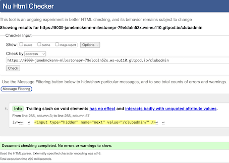
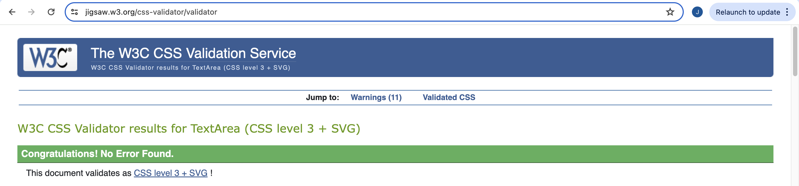

# Testing

[Return to README](README.md)

## Contents

- [Manual Testing](#manual-testing) 
- [User Story Validation](#user-story-validation) 
- [Lighthouse Audit](#lighthouse-audit) 
- [Validator Testing](#validator-testing)
- [Bugs](#bugs)

## Manual Testing

**Device and Browser Testing**

|**Testing** |**iPhone12 safari** |**iPad Pro 9.7" safari**|**MacBook Air Chrome**|**MacBook Air Safari**|**Lenovo MS OS Edge**|**Lenovo MS OS Edge**|**Chrome Developer Tools**|
|-----|-----|-----|-----|-----|-----|-----|-----|
|Responsive|

|**Additional Devices Tested Using Chrome Developer Tools**|**Responsive Observations**
|-----|-----|
|Galaxy S9+| below 375 profile blogs and new blog appear slightly squashed observed on S9+. - media query added|
|Galaxy S20 Ultra|
|Pixel 7|
|iPad Air|
|iPad Mini|
|Surface Pro 7|
|Responsive widths to assess breakpoint issues|

**Manual Testing of User Actions**

|**Feature**     |**Action**     |**Expected Behaviour**     |**Result**     |
|----------------|---------------|---------------------------|---------------|

## User Story Validation

|**User Story**|**Outcome**|**Screengrabs**|
|-----|-----|-----|
|**_FIRST TIME User_**|

|**_RETURNING user_**|

## Lighthouse Audit

The lighthouse audit threw up alot of issues. Some of which I could solve
- I converted my site images from png to webp
- Added a meta description
- Reviewed the contrast on the product page and adjust the hex slightly to improve contrast using [this site](app.contrast-finder.org/)

Some of which I couldn't
- Reviewed where lighthouse claimed alt attributes where missing from images
- 3rd Party Cookies

## Validator Audit

[W3C HTML validator](https://validator.w3.org/)

I tested all pages by URL due to Django templating. I had a few errors which I resolved. On some pages I was left with an interesting info from void elements regarding the closing /. 

[CSS validator Jigsaw](https://jigsaw.w3.org/css-validator/)

I validated my CSS by direct input as the libaries used were causing an error from font awesome and 806 warnings.

[JSHint](jshint.com)
I validated my code using jshint. Due to the use of jQuery $ was undefined and I had missed a semi colon the code passed without any other errors. 

[CI Python Linter](https://pep8ci.herokuapp.com/)

## Bugs

|**Bug**|**Resolution**|
|-----|-----|

trailing , resulting in a tuple on the save_info WH

production versus deployed DB - heroku comand line

datepicker https://stackoverflow.com/questions/61077802/how-to-use-a-datepicker-in-a-modelform-in-django

[Return to README](README.md)