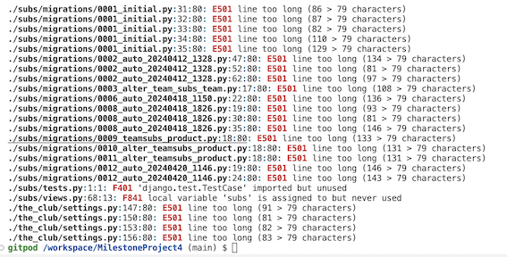

# Testing

[Return to README](README.md)

## Contents

- [Manual Testing](#manual-testing) 
- [User Story Validation](#user-story-validation) 
- [Lighthouse Audit](#lighthouse-audit) 
- [Validator Testing](#validator-testing)
- [Bugs](#bugs)

## Manual Testing

**Device and Browser Testing**

|**Testing** |**iPhone12 safari** |**iPad Pro 9.7" safari**|**MacBook Air Chrome**|**MacBook Air Safari**|**Lenovo MS OS Edge**|**Lenovo MS OS Edge**|**Chrome Developer Tools**|
|-----|-----|-----|-----|-----|-----|-----|-----|
|Responsive|Yes|Yes|Yes|Yes|Yes|Yes|Yes|Yes|
|Delete/Edit buttons visible only to superuser|Yes|Yes|Yes|Yes|Yes|Yes|Yes|Yes|
|Forms won't submit without appropriate information|Yes|Yes|Yes|Yes|Yes|Yes|Yes|
|Toast Messages appear|Yes|Yes|Yes|Yes|Yes|Yes|Yes|

|**Additional Devices Tested Using Chrome Developer Tools**|**Responsive Observations**
|-----|-----|
|Galaxy S9+| |
|Galaxy S20 Ultra|
|Pixel 7|
|iPad Air|
|iPad Mini|
|Surface Pro 7|
|Responsive widths to assess breakpoint issues|

**Manual Testing of User Actions**

|**Feature**     |**Action**     |**Expected Behaviour**     |**Result**     |
|----------------|---------------|---------------------------|---------------|
|Nav Bar|Click Logo|Navigates to home page|Pass|
|Nav Bar|Click Search|Opens Search Box|Pass|
|Nav Bar|Click Shop|Opens shop drop down|Pass|
|Nav Bar|Click Fixtures|Opens Fixtures dropdown|Pass|
|Nav Bar|Click My Account|Opens Account dropdown (logged in) My Profile and Logout shown|Pass|
|Nav Bar|Click My Account|Opens Account dropdown (superuser logged in)Club Admin, My Profile and Logout shown|Pass|
|Nav Bar|Click My Account|Opens Account dropdown(logged out) Login and Register shown|Pass|
|Nav Bar|Click Basket|Opens bag.html|Pass|
|Search Function|Search for item click Enter|Returns appropriate product items on kit page|Pass|
|Search Function|Search for item click Search icon|Returns appropriate  product items on kit page|Pass|
|Nav Bar-Shop Icon|Click Shop Cub Kit|Navigates to kit page|Pass|
|Nav Bar-Shop Icon|Click Pay Club Subs|Navigates to subs page|Pass|
|Nav Bar - Fixtures|Click All Fixtures|Navigates to fixtures page|Pass|
|Nav Bar - My Account|Click Club Admin|Navigates to home page|Pass|
|Nav Bar - My Account|Click My Profile|Navigates to my profile page|Pass|
|Nav Bar - My Account|Click Logout|Navigates to logout page|Pass|
|Nav Bar - My Account|Click Login|Navigates to login page|Pass|
|Nav Bar - My Account|Click Register|Navigates to registration page|Pass|
|Nav Bar - Mobile|Click hamburger icon|Expands Navigation on in row below Nav aligned right|Pass|
|Mobile Nav Bar|Click Logo|Navigates to home page|Pass|
|Mobile Nav Bar|Click Search|Opens Search Box|Pass|
|Mobile Nav Bar|Click Shop|Opens shop drop down|Pass|
|Mobile Nav Bar|Click Fixtures|Opens Fixtures dropdown|Pass|
|Mobile Nav Bar|Click My Account|Opens Account dropdown (logged in) My Profile and Logout shown|Pass|
|Mobile Nav Bar|Click My Account|Opens Account dropdown (superuser logged in)Club Admin, My Profile and Logout shown|Pass|
|Mobile Nav Bar|Click My Account|Opens Account dropdown(logged out) Login and Register shown|Pass|
|Mobile Nav Bar|Click Basket|Opens bag.html|Pass|
|Mobile Search Function|Search for item click Enter|Returns appropriate product items on kit page|Pass|
|Mobile Search Function|Search for item click Search icon|Returns appropriate  product items on kit page|Pass|
|Mobile Nav Bar-Shop Icon|Click Shop Cub Kit|Navigates to kit page|Pass|
|Mobile Nav Bar-Shop Icon|Click Pay Club Subs|Navigates to subs page|Pass|
|Mobile Nav Bar - Fixtures|Click All Fixtures|Navigates to fixtures page|Pass|
|Mobile Nav Bar - My Account|Click Club Admin|Navigates to home page|Pass|
|Mobile Nav Bar - My Account|Click My Profile|Navigates to my profile page|Pass|
|Mobile Nav Bar - My Account|Click Logout|Navigates to logout page|Pass|
|Mobile Nav Bar - My Account|Click Login|Navigates to login page|Pass|
|Mobile Nav Bar - My Account|Click Register|Navigates to registration page|Pass|
|Kit - All Products Page|Click All Products|Filters to All products (except subs)|Pass|
|Kit - All Products Page|Click Sort|Displays sort options|Pass|
|Kit - All Products Page|Click Occassion|Displays occassion options|Pass|
|Sort Options|Click by price|Filters by price|Pass|
|Sort Options|Click by category|Filters by category |Pass|
|Sort Options|Click All products|Filters All products|Pass|
|Occassion Options|Click by match kit|Filters by match kit|Pass|
|Occassion Options|Click by training kit|Filters by training kit |Pass|
|Occassion Options|Click supporters kit|Filters supporters kit|Pass|
|Kit - All products Page|Click product|Opens Product details page|Pass|
|Kit - All products Page (superuser)|Click edit|Opens Edit product Page|Pass|
|Kit - All products Page (superuser)|Click delete|Deletes product and redirects to admin panel|Pass|
|Kit - All products Page|Click product category|Filters to product category clicked|Pass|
|Kit - Product Detail Page (superuser)|Click edit|Opens Edit product Page|Pass|
|Kit - Product Detail Page (superuser)|Click delete|Deletes product and redirects to admin panel|Pass|
|Kit - Product Detail Page|Click product category|Filters to all products of category clicked|Pass|
|Kit - Product Detail Page|Click Product sizes|Opens dropdown of choices|Pass|
|Kit - Product Detail Page|Toggle Quantity up and down|Quanity Toggles between 1-99|Pass|
|Kit - Product Detail Page|Click Keep Shopping|Navigates to all kit|Pass|
|Kit - Product Detail Page|Click Add to Bag|Adds item to bag and success message appears|Pass|
|Home Page|Click Club News|Navigates to all club News|Pass|
|Home Page|Click Full Story|Navigates to News Story|Pass|
|All Club News Page|Click Full Story|Navigates to News Story|Pass|
|News Story Page|Click home|Navigates Home|Pass|
|Pay Club Subs Page|Click Add to Bag|Adds subs to bag and success message appears|Pass|
|Pay Club Subs Page|Click Cancel|Navigates to home page|Pass|
|Fixtures Page|Search fixtures press enter|Filters to search term|Pass|
|Fixtures Page|Search fixtures click search icon|Filters to search term|Pass|
|Fixtures Page|Click All fixtures|Resets to all fixtures|Pass|
|Fixtures Page|Click Home|Navigates to Home|Pass|
|Fixtures Page|Click back to top bottom|Returns to the top of the screen|Pass|
|Shopping Bag Page| Click Remove on subs item|Single line of subs is removed total updates|Pass|
|Shopping Bag Page| Toggle Quantity up and down|Quanity Toggles between 1-99|Pass|
|Shopping Bag Page| Click Remove on Product item|Product is removed  total updates|Pass|
|Shopping Bag Page| Click Update after toggling the quantity Product item|total updates|Pass|
|Shopping Bag Page| Click add subs payment|Navigates to add subs page|Pass|
|Shopping Bag Page| Click Keep Shopping|Navigates to products page|Pass|
|Shopping Bag Page| Click Secure checkout|Navigates to checkout page|Pass|
|Checkout Page|Click Adjust Bag|Navigates bag to Bag|Pass|
|Checkout Page|Fail to enter valid email|Form validation prompt appears|Pass|
|Checkout Page|Fail to enter name|Form validation prompt appears|Pass|
|Checkout Page|Fail to enter required address details|Form validation prompt appears|Pass|
|Checkout Page|Fail to enter valid card|Error appears below Card Div|Pass|
|Checkout Page|Enter expired card details|Error appears below Card Div|Pass|
|Checkout Page|Click Complete Order|Processes Order and displays conformation|Pass|
|Confirmation Page|Click Club News|Navigates to Club News|Pass|
|Confirmation Page|Click Upcoming Fixtures|Navigates to Upcoming Fixtures|Pass|
|My Profile Page|Click Order Number|Navigates to Order Number|Pass|
|My Profile Page|Click Save|Details saved and success notification appears |Pass|
|Logout Page|CLick Home|Navigates to Home|Pass|
|Logout Page|Click Sign Out|Signs out the user, shows success message and navigates to Home|Pass|
|Login Page|Click Home|Navigates to Home|Pass|
|Login Page|Click Sign in|Signs out the user, shows success message and navigates to Home|Pass|
|Login Page|Click Sign up|Navigates to the registration page|Pass|
|Login Page|Click Forgot Password|Navigates to the forgot password Page|Pass|
|Login Page|Click Sign in -no details|Form validation displays|Pass|
|Login Page|Click Sign in -correct details|Naviagtes to Home and displays success message|Pass|

## User Story Validation

|**User Story**|**Outcome**|**Screengrabs**|
|-----|-----|-----|
|**_FIRST TIME User_**|

|**_RETURNING user_**|

## Lighthouse Audit

The lighthouse audit threw up alot of issues. Some of which I could solve
- I converted my site images from png to webp
- Added a meta description
- Reviewed the contrast on the product page and adjust the hex slightly to improve contrast using [this site](app.contrast-finder.org/)

Some of which I couldn't
- Reviewed where lighthouse claimed alt attributes where missing from images
- 3rd Party Cookies

## Validator Audit

[W3C HTML validator](https://validator.w3.org/)

I tested all pages by URL due to Django templating. I had a few errors which I resolved. On some pages I was left with an interesting info from void elements regarding the closing /. 

[CSS validator Jigsaw](https://jigsaw.w3.org/css-validator/)

I validated my CSS by direct input as the libaries used were causing one error from font awesome and 806 warnings in total.

[JSHint](jshint.com)
I validated my code using jshint. Due to the use of jQuery $ was undefined and I had missed a semi colon the code passed without any other errors. 

**Python Validation**

The code was validated using Pythons own Flake8 utility using the command `python3 -m flake8`

I did not attempt to resolve the E501 errors where they were created by migrations. 

I also passed the indivaidual py files through [CI Python Linter](https://pep8ci.herokuapp.com/)

## Bugs

|**Bug**|**Resolution**|
|-----|-----|

trailing , resulting in a tuple on the save_info WH

production versus deployed DB - heroku comand line

datepicker https://stackoverflow.com/questions/61077802/how-to-use-a-datepicker-in-a-modelform-in-django

[Return to README](README.md)