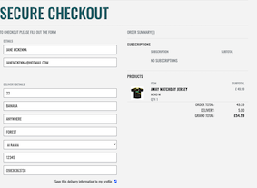
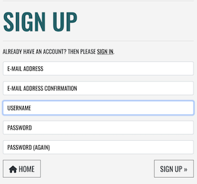
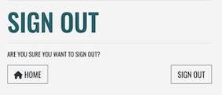
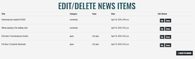
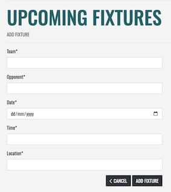
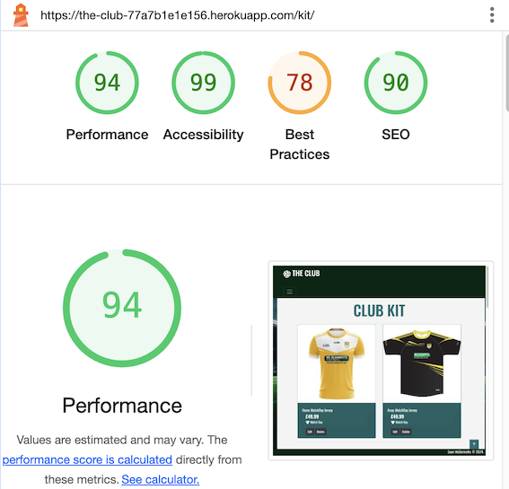

# Testing

[Return to README](README.md)

## Contents

- [Manual Testing](#manual-testing) 
- [User Story Validation](#user-story-validation) 
- [Lighthouse Audit](#lighthouse-audit) 
- [Validator Testing](#validator-testing)
- [Bugs](#bugs)

## Manual Testing

**Device and Browser Testing**

|**Testing** |**iPhone12 safari** |**iPad Pro 9.7" safari**|**MacBook Air Chrome**|**MacBook Air Safari**|**Lenovo MS OS Edge**|**Lenovo MS OS Edge**|**Chrome Developer Tools**|
|-----|-----|-----|-----|-----|-----|-----|-----|
|Responsive|Yes|Yes|Yes|Yes|Yes|Yes|Yes|Yes|
|Delete/Edit buttons visible only to superuser|Yes|Yes|Yes|Yes|Yes|Yes|Yes|Yes|
|Forms won't submit without appropriate information|Yes|Yes|Yes|Yes|Yes|Yes|Yes|
|Toast Messages appear|Yes|Yes|Yes|Yes|Yes|Yes|Yes|

|**Additional Devices Tested Using Chrome Developer Tools**|**Responsive Observations**
|-----|-----|
|Galaxy S9+| |
|Galaxy S20 Ultra|
|Pixel 7|
|iPad Air|
|iPad Mini|
|Surface Pro 7|
|Responsive widths to assess breakpoint issues|

**Manual Testing of User Actions**

|**Feature**     |**Action**     |**Expected Behaviour**     |**Result**     |
|----------------|---------------|---------------------------|---------------|
|Nav Bar|Click Logo|Navigates to home page|Pass|
|Nav Bar|Click Search|Opens Search Box|Pass|
|Nav Bar|Click Shop|Opens shop drop down|Pass|
|Nav Bar|Click Fixtures|Opens Fixtures dropdown|Pass|
|Nav Bar|Click My Account|Opens Account dropdown (logged in) My Profile and Logout shown|Pass|
|Nav Bar|Click My Account|Opens Account dropdown (superuser logged in)Club Admin, My Profile and Logout shown|Pass|
|Nav Bar|Click My Account|Opens Account dropdown(logged out) Login and Register shown|Pass|
|Nav Bar|Click Basket|Opens bag.html|Pass|
|Search Function|Search for item click Enter|Returns appropriate product items on kit page|Pass|
|Search Function|Search for item click Search icon|Returns appropriate  product items on kit page|Pass|
|Nav Bar-Shop Icon|Click Shop Cub Kit|Navigates to kit page|Pass|
|Nav Bar-Shop Icon|Click Pay Club Subs|Navigates to subs page|Pass|
|Nav Bar - Fixtures|Click All Fixtures|Navigates to fixtures page|Pass|
|Nav Bar - My Account|Click Club Admin|Navigates to home page|Pass|
|Nav Bar - My Account|Click My Profile|Navigates to my profile page|Pass|
|Nav Bar - My Account|Click Logout|Navigates to logout page|Pass|
|Nav Bar - My Account|Click Login|Navigates to login page|Pass|
|Nav Bar - My Account|Click Register|Navigates to registration page|Pass|
|Nav Bar - Mobile|Click hamburger icon|Expands Navigation on in row below Nav aligned right|Pass|
|Mobile Nav Bar|Click Logo|Navigates to home page|Pass|
|Mobile Nav Bar|Click Search|Opens Search Box|Pass|
|Mobile Nav Bar|Click Shop|Opens shop drop down|Pass|
|Mobile Nav Bar|Click Fixtures|Opens Fixtures dropdown|Pass|
|Mobile Nav Bar|Click My Account|Opens Account dropdown (logged in) My Profile and Logout shown|Pass|
|Mobile Nav Bar|Click My Account|Opens Account dropdown (superuser logged in)Club Admin, My Profile and Logout shown|Pass|
|Mobile Nav Bar|Click My Account|Opens Account dropdown(logged out) Login and Register shown|Pass|
|Mobile Nav Bar|Click Basket|Opens bag.html|Pass|
|Mobile Search Function|Search for item click Enter|Returns appropriate product items on kit page|Pass|
|Mobile Search Function|Search for item click Search icon|Returns appropriate  product items on kit page|Pass|
|Mobile Nav Bar-Shop Icon|Click Shop Cub Kit|Navigates to kit page|Pass|
|Mobile Nav Bar-Shop Icon|Click Pay Club Subs|Navigates to subs page|Pass|
|Mobile Nav Bar - Fixtures|Click All Fixtures|Navigates to fixtures page|Pass|
|Mobile Nav Bar - My Account|Click Club Admin|Navigates to home page|Pass|
|Mobile Nav Bar - My Account|Click My Profile|Navigates to my profile page|Pass|
|Mobile Nav Bar - My Account|Click Logout|Navigates to logout page|Pass|
|Mobile Nav Bar - My Account|Click Login|Navigates to login page|Pass|
|Mobile Nav Bar - My Account|Click Register|Navigates to registration page|Pass|
|Kit - All Products Page|Click All Products|Filters to All products (except subs)|Pass|
|Kit - All Products Page|Click Sort|Displays sort options|Pass|
|Kit - All Products Page|Click Occassion|Displays Occassion options|Pass|
|Sort Options|Click by price|Filters by price|Pass|
|Sort Options|Click by category|Filters by category |Pass|
|Sort Options|Click All products|Filters All products|Pass|
|Occassion Options|Click by match kit|Filters by match kit|Pass|
|Occassion Options|Click by training kit|Filters by training kit |Pass|
|Occassion Options|Click supporters kit|Filters supporters kit|Pass|
|Kit - All products Page|Click product|Opens Product details page|Pass|
|Kit - All products Page (superuser)|Click edit|Opens Edit product Page|Pass|
|Kit - All products Page (superuser)|Click delete|Deletes product and redirects to admin panel|Pass|
|Kit - All products Page|Click product category|Filters to product category clicked|Pass|
|Kit - Product Detail Page (superuser)|Click edit|Opens Edit product Page|Pass|
|Kit - Product Detail Page (superuser)|Click delete|Deletes product and redirects to admin panel|Pass|
|Kit - Product Detail Page|Click product category|Filters to all products of category clicked|Pass|
|Kit - Product Detail Page|Click Product sizes|Opens dropdown of choices|Pass|
|Kit - Product Detail Page|Toggle Quantity up and down|Quantity Toggles between 1-99|Pass|
|Kit - Product Detail Page|Click Keep Shopping|Navigates to all kit|Pass|
|Kit - Product Detail Page|Click Add to Bag|Adds item to bag and success message appears|Pass|
|Home Page|Click Club News|Navigates to all club News|Pass|
|Home Page|Click Full Story|Navigates to News Story|Pass|
|All Club News Page|Click Full Story|Navigates to News Story|Pass|
|News Story Page|Click home|Navigates Home|Pass|
|Pay Club Subs Page|Click Add to Bag|Adds subs to bag and success message appears|Pass|
|Pay Club Subs Page|Click Cancel|Navigates to home page|Pass|
|Fixtures Page|Search fixtures press enter|Filters to search term|Pass|
|Fixtures Page|Search fixtures click search icon|Filters to search term|Pass|
|Fixtures Page|Click All fixtures|Resets to all fixtures|Pass|
|Fixtures Page|Click Home|Navigates to Home|Pass|
|Fixtures Page|Click back to top bottom|Returns to the top of the screen|Pass|
|Shopping Bag Page| Click Remove on subs item|Single line of subs is removed total updates|Pass|
|Shopping Bag Page| Toggle Quantity up and down|Quantity Toggles between 1-99|Pass|
|Shopping Bag Page| Click Remove on Product item|Product is removed  total updates|Pass|
|Shopping Bag Page| Click Update after toggling the quantity Product item|total updates|Pass|
|Shopping Bag Page| Click add subs payment|Navigates to add subs page|Pass|
|Shopping Bag Page| Click Keep Shopping|Navigates to products page|Pass|
|Shopping Bag Page| Click Secure checkout|Navigates to checkout page|Pass|
|Checkout Page|Click Adjust Bag|Navigates bag to Bag|Pass|
|Checkout Page|Fail to enter valid email|Form validation prompt appears|Pass|
|Checkout Page|Fail to enter name|Form validation prompt appears|Pass|
|Checkout Page|Fail to enter required address details|Form validation prompt appears|Pass|
|Checkout Page|Fail to enter valid card|Error appears below Card Div|Pass|
|Checkout Page|Enter expired card details|Error appears below Card Div|Pass|
|Checkout Page|Click Complete Order|Processes Order and displays conformation|Pass|
|Confirmation Page|Click Club News|Navigates to Club News|Pass|
|Confirmation Page|Click Upcoming Fixtures|Navigates to Upcoming Fixtures|Pass|
|My Profile Page|Click Order Number|Navigates to the Order Number order detail|Pass|
|Historical Order|Click on my profile|Navigates back to the profile page|Pass|
|My Profile Page|Click Save|Details saved and success notification appears |Pass|
|Logout Page|CLick Home|Navigates to Home|Pass|
|Logout Page|Click Sign Out|Signs out the user, shows success message and navigates to Home|Pass|
|Login Page|Click Home|Navigates to Home|Pass|
|Login Page|Click Sign in|Signs in the user, shows success message and navigates to Home|Pass|
|Login Page|Click Sign up|Navigates to the registration page|Pass|
|Login Page|Click Forgot Password|Navigates to the forgot password Page|Pass|
|Login Page|Click Sign in -no details|Form validation displays|Pass|
|Login Page|Click Sign in -correct details|Navigates to Home and displays success message|Pass|
|Register Page|Click Sign in|Navigates to the sign in page|Pass|
|Register Page|Click home|Navigates Home|Pass|
|Register Page|Fail to enter valid email|Form validation prompt appears|Pass|
|Register Page|Fail to enter matching email|Form validation prompt appears|Pass|
|Register Page|Enter email already in use|Form validation prompt appears|Pass|
|Register Page|Enter username already in use|Form validation prompt appears|Pass|
|Register Page|Enter passwords that do not match|Form validation prompt appears|Pass|
|Register Page|Enter all valid information and click sign up|Navigates to Home page and success message appears|Pass|
|Club Admin Page|Click Add New Product |Navigates to Add New Product|Pass|
|Club Admin Page|Click Edit/Delete Product|Navigates to Edit/Delete Product|Pass|
|Club Admin Page|Click Manage Categories|Navigates to Manage Categories|Pass|
|Club Admin Page|Click Add News |Navigates to Add News|Pass|
|Club Admin Page|Click Edit/Delete News|Navigates to Edit/Delete News|Pass|
|Club Admin Page|Click Update Fixtures |Navigates to Update Fixtures|Pass|
|Club Admin Page|Click Manage Players|Navigates to Manage Players|Pass|
|Club Admin Page|Click View Subs|Navigates to All Subs|Pass|
|Add Product Page|Submit invalid form|Form validation displays |Pass|
|Add Product Page|Click Choose File|Pop up to choose media file appears|Pass|
|Add Product Page|Click All products|Navigates to All products|Pass|
|Add Product Page|Click list product|Navigates to club admin and success message displays|Pass|
|Add Product Page|Click back to admin|Navigates to club admin |Pass|
|Edit/Delete Kit Page|Click Edit button on a product|Navigates to Edit Product page with appropriate product detail loaded|Pass|
|Edit/Delete Kit Page|Click Delete button on a product|Deletes product form list and displays success message|Pass|
|Edit/Delete Kit Page|Click back to admin|Navigates to club admin |Pass|
|Edit Product Page|Submit invalid form|Form validation displays |Pass|
|Edit Product Page|Click Choose File|Pop up to choose media file appears|Pass|
|Edit Product Page|Click Cancel|Navigates to All products|Pass|
|Edit Product Page|Click update product|Navigates to club admin and success message displays|Pass|
|Edit Product Page|Click back to admin|Navigates to club admin |Pass|
|Manage Categories Page|Click Add New Category |Navigates to Add New Category|Pass|
|Manage Categories Page|Click Edit on Category| Navigates to Edit screen with appropriate data loaded, displays message that you are editing the category 'name'|Pass
|Manage Categories Page|Click Delete button on a category|Deletes category form list and displays success message|Pass|
|Manage Categories Page|Click back to admin|Navigates to club admin |Pass|
|Add New Category Page|Click Cancel|Navigates to All products|Pass|
|Add New Category Page|Submit invalid form|Form validation displays |Pass|
|Add New Category Page|Click Add Category|Navigates to Club admin and success message displays|Pass|
|Add New Category Page|Click back to admin|Navigates to club admin |Pass|
|Edit Category Page|Click Cancel|Navigates to manage categories|Pass|
|Edit Category Page|Submit invalid form|Form validation displays |Pass|
|Edit Category Page|Click Edit Category|Navigates to Club admin and success message displays|Pass|
|Edit Category Page|Click back to admin|Navigates to club admin |Pass|
|Add News Page|Submit invalid form|Form validation displays |Pass|
|Add News Page|Click Choose File|Pop up to choose media file appears|Pass|
|Add News Page|Click Cancel|Navigates to club admin|Pass|
|Add News Page|Click add news|Navigates to club admin and success message displays|Pass|
|Add News Page|Click back to admin|Navigates to club admin |Pass|
|Edit/Delete News|Click Edit button on a news item|Navigates to Edit news page with appropriate news detail loaded|Pass|
|Edit/Delete News|Click Delete button on a news item|Deletes news form list and displays success message|Pass|
|Edit/Delete News|Click back to admin|Navigates to club admin |Pass|
|Manage Fixtures|Click Add New Fixture|Navigates to Add New Fixture|Pass|
|Manage Fixtures|Click Edit button on a fixture item|Navigates to Edit fixture page with appropriate fixture detail loaded|Pass|
|Manage Fixtures|Click Delete button on a fixture item|Deletes fixture form list and displays success message|Pass|
|Manage Fixtures|Click back to admin|Navigates to club admin |Pass|
|Add New Fixture Page|Click Cancel|Navigates to manage fixtures|Pass|
|Add New Fixture Page|Submit invalid form|Form validation displays |Pass|
|Add New Fixture Page|Click Add Fixture|Navigates to Club admin and success message displays|Pass|
|Add New Fixture Page|Click back to admin|Navigates to club admin |Pass|
|Edit Fixture Page|Click Cancel|Navigates to manage fixtures|Pass|
|Edit Fixture Page|Submit invalid form|Form validation displays |Pass|
|Edit Fixture Page|Click Edit fixture|Navigates to manage fixtures and success message displays|Pass|
|Edit Fixture Page|Click back to admin|Navigates to club admin |Pass|
|Manage Players Page|Click Add New Player|Navigates to Add New Player|Pass|
|Manage Players Page|Click Edit button on a Player item|Navigates to Edit Player page with appropriate fixture detail loaded|Pass|
|Manage Players Page|Click Delete button on a Player item|Deletes Player form list and displays success message|Pass|
|Manage Players Page|Click back to admin|Navigates to club admin |Pass|
|Add New Player Page|Click Cancel|Navigates to manage Players|Pass|
|Add New Player Page|Submit invalid form|Form validation displays |Pass|
|Add New Player Page|Click Add Player|Navigates to manage players and success message displays|Pass|
|Add New Player Page|Click back to admin|Navigates to club admin |Pass|
|Edit Player Page|Click Cancel|Navigates to Manage Players|Pass|
|Edit Player Page|Submit invalid form|Form validation displays |Pass|
|Edit Player Page|Click Edit Player|Navigates to manage players and success message displays|Pass|
|Edit Player Page|Click back to admin|Navigates to club admin |Pass|
|View Subs Page|Click manually add subs|Navigate to manually add subs|Pass|
|View Subs Page|Click back to admin|Navigates to club admin |Pass|
|Manually Add Subs Page|Click Cancel|Navigates to View Subs page|Pass|
|Manually Add Subs Page|Submit form without providing information|Validation for minimum period 1 and must choose team appears|Pass|
|Manually Add Subs Page|Click Add Subs (valid form)|Navigates to view subs and success message appears|Pass|
|Manually Add Subs Page|Click back to admin|Navigates to club admin |Pass|

## User Story Validation

[User Outcomes Google Docs](https://docs.google.com/spreadsheets/d/1QvcKgmC9WbiC6ZFg4j-qCKpRea_9rqwP6MOy0nx6mpA/edit?usp=sharing)

|**User Story**|**Outcome**|**Screengrabs**|
|-----|-----|-----|
|**_FIRST TIME User_**|
|Intuitively and easily navigate the site|Layout is traditional and intuitive with a familiar navigational layout. Searching is available directly from the nav. On mobile devices a familiar hamburger icon is used.||
|Browse club items for sale|Browsing Club items for sale is easy and intuitive, you can search, scroll or filter by occasion or price. | |
|Purchase club gear|You can purchase club gear| |
|Read news|News can be read via the home page with an additional prompt after purchase| |
|Find upcoming fixture|Fixtures can be found via the main Nav and are searchable| |
|Register as a user|Registration as a user is possible||
|Logout of the site|Logout process is easy and quick.| |
|**_RETURNING user_**|
|Log in and out of the site|Logging in and out of the site is easy and password reset is possible||
|Pay subs|You can easily pay for club subs by choosing the appropriate player| |
Browsing Club items for sale is easy and intuitive, you can search, scroll or filter by occasion or price. | |
|Purchase club gear|You can purchase club gear||
|Review most recent news easily|News on the home page is filtered to the 10 most recent items and on the all news page is reverse chronological order| |
|See updated fixtures|fixtures are filtered so that future dated fixtures appear||
|Search for specific fixtures|search is available on fixtures||
|**_ADMIN user_**|
|Manage Product Categories (add, edit, delete) |You can manage Product Categories via the club admin Panel |  |
|Manage Products (add, edit, delete) |You can manage Product via the club admin Panel | |
|Manage News (add, edit, delete) |You can manage News via the club admin Panel | |
|Manage Fixtures (add, edit, delete) |You can manage Fixtures via the club admin Panel | |
|Manage Players (add, edit, delete) |You can manage Players via the club admin Panel | |
|Manage Subs (view and add) |You can manage Subs via the club admin Panel | |

## Lighthouse Audit

The lighthouse audit threw up a lot of issues. Some of which I could solve
- I converted my site images from png to webp
- Added a meta description
- Reviewed the contrast on the product page and adjust the hex slightly to improve contrast using [this site](app.contrast-finder.org/)

Some of which I couldn't in relation to best practice
- 3rd Party Cookies

## Validator Audit

[W3C HTML validator](https://validator.w3.org/)

I tested all pages by URL due to Django templating. I had a few errors which I resolved. On some pages I was left with an interesting info from void elements regarding the closing /. 

[CSS validator Jigsaw](https://jigsaw.w3.org/css-validator/)

I validated my CSS by direct input as the libraries used were causing one error from font awesome and 806 warnings in total.

[JSHint](jshint.com)

I validated my code using jshint. Due to the use of jQuery $ was undefined and I had missed a semi colon the code passed without any other errors. 

**Python Validation**

The code was validated using Pythons own Flake8 utility using the command `python3 -m flake8`

I did not attempt to resolve the E501 errors where they were created by migrations. 

I also passed the individual py files through [CI Python Linter](https://pep8ci.herokuapp.com/)

## Interesting Bugs

I worked through a lot of bugs naturally as I coded this project. I have included some of the more interesting ones below. 

|**Bug**|**Resolution**|
|-----|-----|
|Integrating subs and product models into a single basket and order model|This took me a lot of trail and error to unpick. In the end I have a product marked is_sub=True which doesn't display with the products on the all products page. The subs page passes the PK for the subs 'product' in the context. Once I had worked this through it was a mater of refactoring the code to handle and display the two types of 'product' as appropriate. The eventual solution proved a lot simpler than some of the convoluted approaches I tried before reversing back and coming to this solution|
|Tuple being created on save_info in webhook| I had left a trailing , in the code|
|On deployed version of the site I was getting 500 server errors, I traced this back to when the code was interacting with any news model|It appeared to be caused by new migrations I had made since initial deployment. My Postgres DB wasn't being updated during the build on heroku. Some research led me to the command line on heroku, once I ran the bash command I was then able to run the migrations which fixed the issue.|
|On the fixtures form the date picker wasn’t being displayed but then due to the open text field the form validation wasn't allowing submission as the date wasn't in the correct format.|I found [this](https://stackoverflow.com/questions/61077802/how-to-use-a-datepicker-in-a-modelform-in-django) solution which worked|
|On the manually add subs form, as a player name loaded in the form automatically it was allowing a form to be submitted without providing the team or period information|On searching for a solution I [came across](https://stackoverflow.com/questions/60298923/what-are-the-differences-between-using-self-add-error-and-raising-a-validation) the clean() method and with some more reading made it work. The documentation can be found [here](https://docs.djangoproject.com/en/5.0/topics/forms/modelforms/)|
|I had some side scroll issues due to table sizes on some of the admin pages and the all news page, when I used bootstrap to hide certain colums/elements the result was the cells were misaligned when they were displayed |I found the solution in the bootstrap documentation [here](https://getbootstrap.com/docs/4.6/utilities/display/) instead of using d-inline to use d-table-cell|
|submitting form not passing on_admin_page therefore displaying bag items on message|On the form versions it wont pass as 'on_admin_page'= on_admin_page needs to be 'on_admin_page'= True in the context but you cannot define 'on_admin_page'= True in the view above or it doesn’t work. I will have to research further why but this solution has worked. |

[Return to README](README.md)

